<p align="center">
  
</p>

# MorsVitaEst

> An AI app where your conversations, memory, projects, and skills live on your device — not on a vendor's servers. Swap freely between Claude, ChatGPT, Gemini, OpenRouter, or a local model running on your phone. Your context follows you. Your data never leaves.

The name means **death is life**. Finished systems should not stay frozen — they shed old shapes, absorb better ones, and keep becoming more useful without losing their center.

## Why MVE exists

Every commercial AI chat app is built around the same loop: you talk to their model, your chat lives on their servers, your data trains their next model. Switch providers and you lose your history. Try to opt out of training and you can't. Your relationship with AI is rented from someone.

MVE flips this. **The app is the ecosystem. The AI is the messenger.** Memory, conversations, skills, tools, files, and projects live in locally-encrypted storage on your device. Each AI provider just gets the slice of context relevant to your current message — assembled by the app, on your terms, in your interest.

## Privacy posture

- **Local-first.** Conversations, memory, project context, files, API keys — all on-device, locally encrypted.
- **No telemetry.** MVE doesn't ship usage data anywhere. Open source means you can verify.
- **Vendor isolation.** Each provider sees only the slice of context relevant to the current turn. They never see your memory layer, your other conversations, your other projects, or any history you didn't include.
- **No account.** No sign-up. No phone-home. The app is the account.
- **Encrypted portability.** Conversations, keys, and memories package into a single encrypted file you can move between devices.

## What you get

- **Mobile-first.** Phone is the primary target; desktop and web are secondary.
- **Provider-agnostic.** Anthropic, OpenAI, Gemini, OpenRouter, local Ollama, on-device Qwen / Llama / Gemma via llama.cpp — same chat, swap freely, each one toggleable.
- **On-device local LLM.** Run uncensored 3B-class models entirely on your phone with no network at all. One-tap install via curated Quick-install buttons.
- **Persistent Projects.** A project's instructions follow you across every model. Change providers; the framing stays.
- **MCP-native.** Industry-standard tool protocol. Twelve popular MCP servers built in (HuggingFace, Zapier, Jina, Fetch, DeepWiki, …) with one-tap-add, plus a link to the awesome-mcp-servers community list.
- **Five-color agent system.** Planner / Safety / Operator / Memory / Synthesis lanes for separating concerns inside a single conversation.
- **Heartbeat.** Personal information engine — point it at your sources (GitHub trending, RSS, papers, anything you care about) and it surfaces what's new for you each time you open the app.
- **Voice-ready.** Spoken replies and per-agent voice personalities.
- **Embedded sandbox.** Full Linux environment inside the app with a working shell, file manager, and package manager. The agent can execute code and operate tools without leaving the device.

## Architecture — why it's different

> The app is the source of truth. The AI is the messenger.

Every other AI chat app: AI vendor stores your history; the app is a thin client.

MVE: **app stores everything forever.** Before sending a message, the app composes the prompt — active project's instructions + relevant memories + relevant files + the relevant slice of chat history that fits the chosen model's context window. The AI receives that assembled prompt and replies. The AI never "remembers" — the app decides what to include each turn.

Concretely this means:
- Switch from Claude to OpenRouter to local Qwen mid-conversation. Same context. No "starting over."
- Vendor deprecates a model. Your data is unaffected.
- Vendor changes pricing. Switch providers; nothing else changes.
- Vendor mines its API for training. Your stored data was never on their servers — only the one prompt for one turn was, on your authorization.

## Install

The latest sideloadable preview APK is always at:

[`MorsVitaEst-android-preview.apk`](https://github.com/ether4o4/MorsVitaEst/releases/download/android-preview-latest/MorsVitaEst-android-preview.apk)

URL is stable — the file behind it auto-updates on every push to `main`. See the [Releases tab](https://github.com/ether4o4/MorsVitaEst/releases) for dated versions.

**To install:**

1. Download the APK on your Android device
2. Tap to install (allow "install from unknown sources" if prompted)
3. Installs in-place over previous debug/preview builds — app data is preserved across updates

> Sideloadable preview, not a Play Store release. Signed with the repo's shared debug keystore.

## Support the work

MVE is open source and built solo. If it's useful, [sponsor it on GitHub](https://github.com/sponsors/ether4o4). Tiers + what your sponsorship goes toward are in [SPONSORS.md](./SPONSORS.md).

## Dev

```bash
./gradlew :composeApp:desktopTest
./gradlew :androidApp:assembleFossDebug
./gradlew :screenshotTests:updateScreenshots
```

Android and local-LLM workflows are first-class — a change that only works on desktop isn't finished.

## Direction

MVE keeps becoming. Less demo surface, more real capability. Less generic assistant, more mobile operator. Less static app, more living infrastructure. Less vendor-rented, more user-owned.
