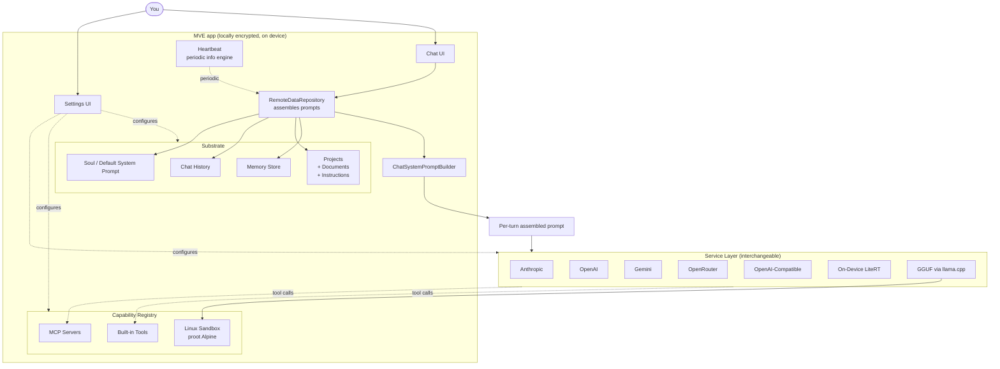

# Architecture

**Last verified:** 2026-06-04

MorsVitaEst is a Kotlin Multiplatform Compose app structured around a single thesis: **the app is the source of truth; the AI is a messenger.** The substrate stores everything; each AI provider sees only the slice of context relevant to the current turn, assembled by the app at send time.

## High-level layout

## The send-a-message path

1. User types a message in **ChatUI**.
2. **RemoteDataRepository.ask()** is called.
3. **ChatSystemPromptBuilder** assembles the system prompt from:
   - The active **Project**'s instructions + documents
   - The current **Soul** (user-customized or `default_soul` from `strings.xml`)
   - Relevant **Memories** (general, preferences, learnings, errors)
   - The current **Runtime context** (local time, platform, active model)
   - The user's **registered Capabilities** (tools, MCP servers)
4. The assembled prompt + filtered chat history (trimmed to fit the model's window via RAG-lite scoring) is sent to the **active enabled Service**.
5. The Service responds. Tool calls (if any) are dispatched through the **Tools** / **MCP servers** layer. Responses go back to the model until it produces a final text reply.
6. The reply lands in **ChatUI** and gets appended to **Chat History**.

The Service has no persistent state of the user. Every turn is composed from scratch by the app.

## Key files

| Layer | File | Purpose |
|---|---|---|
| Substrate | `data/AppSettings.kt` + `data/AppSettingsService.kt` | All persistence — soul, memories, projects, service config, toggles |
| Substrate | `data/Project.kt` | Project + ProjectDocument data classes |
| Substrate | `data/MemoryStore.kt` (via repository) | Memory entries with categories |
| Substrate | `data/RemoteDataRepository.kt` | Composition point — assembles per-turn prompts, routes responses |
| Substrate | `data/ChatSystemPromptBuilder.kt` | Pure builder for the per-turn system prompt |
| Capabilities | `mcp/` | MCP server registry + popular-servers list |
| Capabilities | `tools/` | Built-in tools (memory_store, schedule_task, etc.) |
| Capabilities | `sandbox/` (Android) | proot Alpine Linux runtime + GGUF / llama.cpp engine manager |
| Services | `service/` + `network/dtos/` | One file per provider; pluggable contract |
| UI | `ui/chat/` | Chat screen + composer + message rendering |
| UI | `ui/settings/` | Settings tabs — Services / Projects / Local LLM / Tools / etc. |
| Platform | `Platform.kt` (commonMain) + `*.android.kt`, `*.desktopMain.kt` | Platform-specific surface (file system, sandbox, voice, notifications) |

## Why this shape

- **Provider-agnostic.** Swap from Claude to Gemini to a local GGUF mid-conversation. Same substrate, same context, no "starting over."
- **Vendor isolation.** Each Service sees one prompt for one turn. They never see your memory layer, other conversations, other projects, or any history you didn't include.
- **No phone-home.** Every layer above the Services lives on-device. No telemetry, no analytics, no server-side state. Verifiable by reading the source.
- **Capabilities are visitors.** Tools, MCP servers, devices, and voices plug into the substrate; the substrate doesn't depend on any specific one. Replace, remove, or add without breaking what's already accumulated.

## What's not yet built (and is referenced in [README → Where it's headed](../README.md#where-its-headed))

- A real **memory graph** with causal edges (today's memory store is a flat list with categories).
- An explicit **narrative / Self document** that filters all retrieval (today's projects come close but aren't user-scoped).
- A **council / multi-agent planning layer** (today's send loop is single-agent).
- A **right-to-repudiate** primitive (today's UI only supports outright deletion).
- **Federation** across devices (today's encrypted-export-and-import works but isn't seamless).

See [README → Where it's headed](../README.md#where-its-headed) for the full forward roadmap.
